# Style Transformer

For this project, I will explore one of the deep learning applications in the area of
Computer Vision, specically Image Style Transfer, which transfers the style (mostly art
painting) from one image into the target image (mostly landscape photo). The synthesized
image contains both the object structure in the target image and the style in the art image.
Before deep learning became popular, processing such tasks was difficult due to the lack of
image representations that explicitly represent the semantic information. By using
Convolutional neural networks, we can derive such feature representations and then
synthesizes both the structure and style together. And it generalizes very well to handle
different scene images and art style images

### Notice
I built two versions of style Transformer. V1 used hook mechanism to capture feature maps and V2 built a new model that directly computes the loss. The resulting images from both versions are different.

## Pacakage Requirements
* Pytorch (latest version)
* Python 3.8.5 and above
* CUDA-enabled GPU

## Colab Notebook

[V1](https://github.com/zzyrd/Style-Transformer/blob/main/style_transformer_V1.ipynb)
contains all the implementation details of hooking method that was used for extracing feature maps.

[V2](https://github.com/zzyrd/Style-Transformer/blob/main/style_transformer_V2.ipynb)
contains all the implementation details of self-defined model that computes loss within 
the neural net model.

[Report](https://github.com/zzyrd/Style-Transformer/blob/main/report.pdf) 
contains a full project report, discussing all the technical details and comments on different results.

## Results

Content Images:

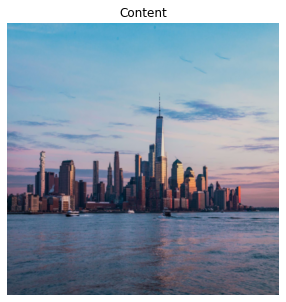
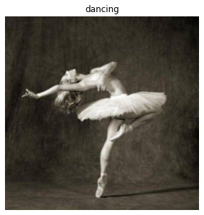
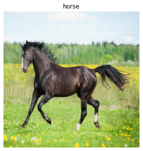

<!-- Style Images:

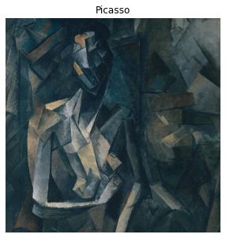
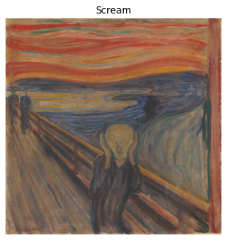
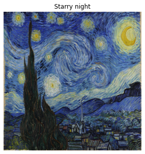

V1 results:

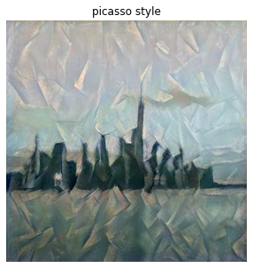
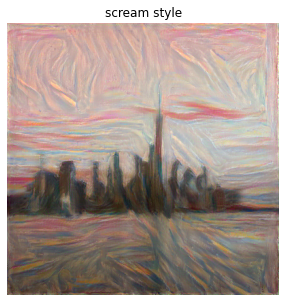
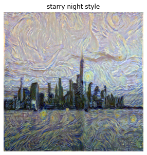
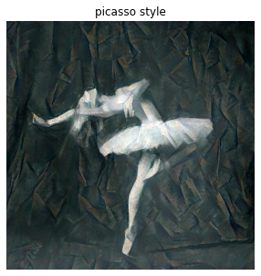
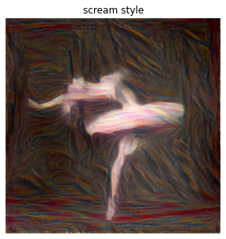
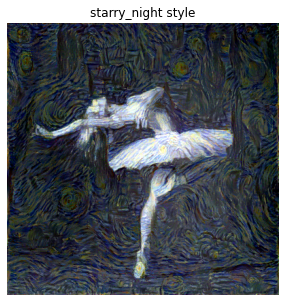
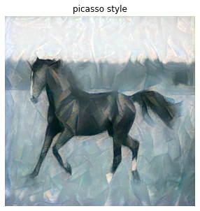
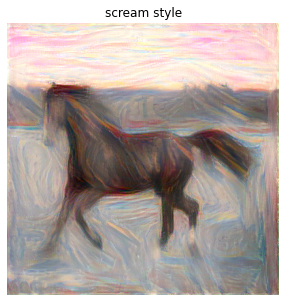
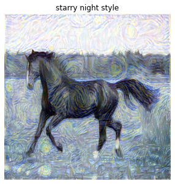

V2 results:

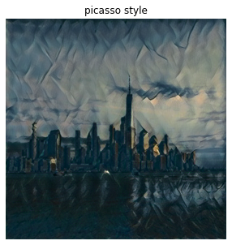
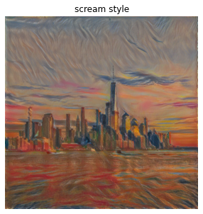
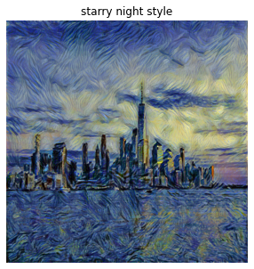
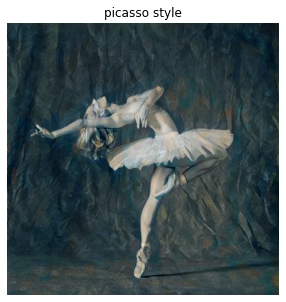
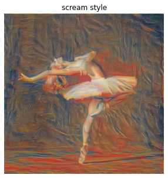
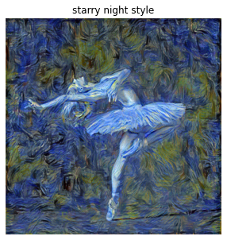
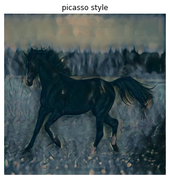
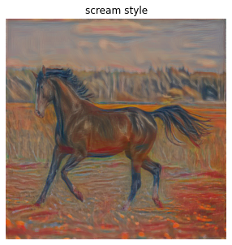
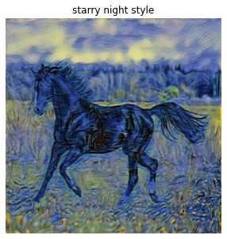 -->

